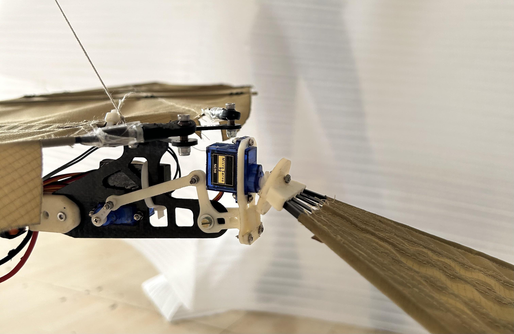
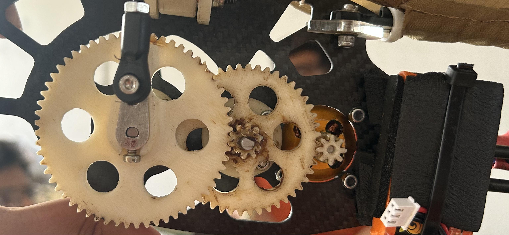
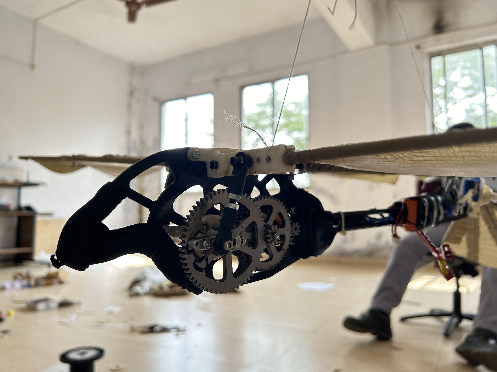
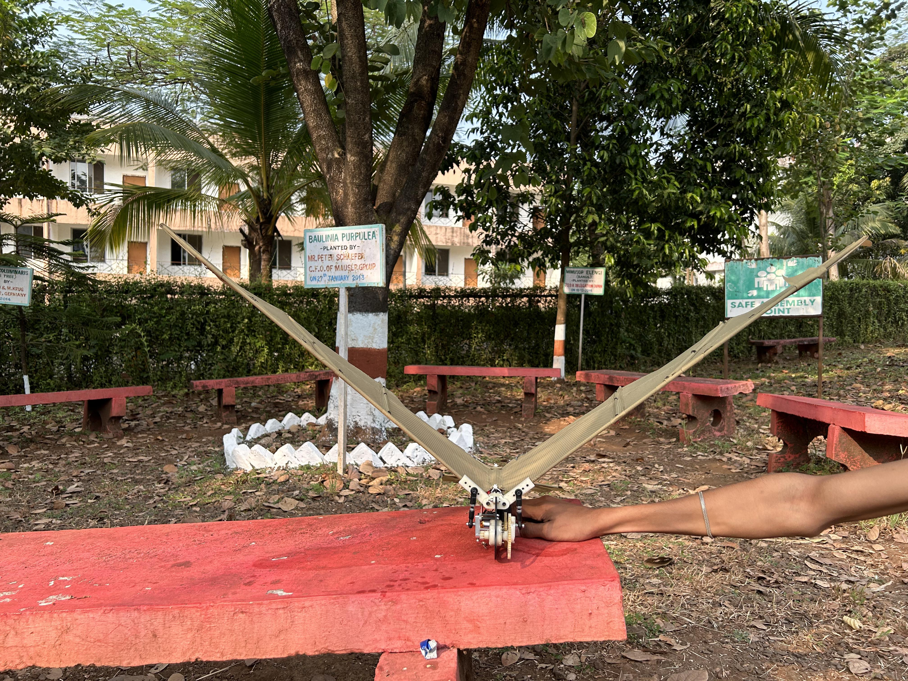
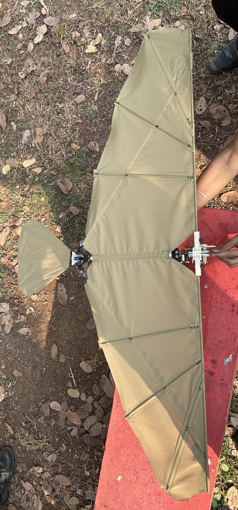

# Bird Drone – Flapping Wing UAV

## Project Overview
The **Bird Drone** is a biomimetic flapping-wing Unmanned Aerial Vehicle (UAV). Designed to mimic the natural flight mechanics of birds, it utilizes lightweight 3D-printed components to achieve consistent and reliable flight performance. 

## Motivation
Traditional fixed-wing and rotary-wing drones are highly efficient but lack the natural maneuverability, stealth, and biological integration of flapping-wing flight. The motivation behind this project is to explore biomimetics in aerial robotics, aiming for more organic and energy-efficient flight profiles.

## Problem Statement
Creating a functional flapping-wing drone requires balancing aerodynamics, structural integrity, and weight. The actuation system must be powerful enough to generate lift yet light enough to be carried by the drone itself, while maintaining stable, controlled flight.

## Objectives
- Design and construct a lightweight, 3D-printed flapping-wing UAV.
- Stabilize the mechanical structure and actuation system for reliable flight.
- Integrate an ESP32-CAM for wireless control and live video streaming.
- Develop a custom mobile application for real-time teleoperation.

## Key Features
- **Biomimetic Flight**: Natural flapping motion providing lift and thrust.
- **Lightweight Airframe**: Custom 3D-printed components for structural rigidity and low mass.
- **Live Video Streaming**: Real-time FPV feed via the onboard ESP32-CAM.
- **Wireless Teleoperation**: In-house mobile application for direct Wi-Fi control.

## Biomimetic Inspiration
The mechanical design mimics the kinematics of avian flight, utilizing an oscillating mechanism that translates rotary motor motion into synchronized wing flapping.

## Mechanical Design
The airframe is primarily constructed from lightweight 3D-printed parts (PLA/PETG/Carbon Fiber blends) to ensure a high strength-to-weight ratio. The flapping mechanism utilizes gears and linkages to convert the high-RPM motor output into high-torque flapping oscillations.

## Hardware Used
- Core Processor/Camera: ESP32-CAM
- Actuation: Coreless DC Motors / Brushless Motors (TODO: Specify exactly)
- Battery: High-discharge LiPo battery
- Structure: 3D Printed Chassis and Wing Spars
- Wings: Lightweight ripstop nylon or carbon fiber film (TODO: Specify exactly)

## Electronics
The central nervous system of the drone is the ESP32-CAM. It handles:
- PWM signal generation for motor speed control (thrust/flapping frequency).
- Servo control for tail steering (pitch/yaw).
- Encoding and transmitting MJPEG video streams over Wi-Fi.

## Software Stack
- **Firmware**: C++ (ESP-IDF / Arduino core) for ESP32-CAM.
- **Mobile Application**: Custom Android/iOS app (TODO: specify framework, e.g., Flutter/Java).

## Mobile Application
The drone is operated using a custom mobile app developed in-house. It connects directly to the ESP32-CAM's Wi-Fi access point (AP) to:
- View the live video feed.
- Control the drone's throttle and steering via a virtual joystick interface.

## System Architecture
TODO: Add Block Diagram showing Mobile App <-> Wi-Fi <-> ESP32-CAM <-> Motors/Servos.

## Working Principle
The mobile app acts as the ground control station, sending UDP/TCP control packets to the ESP32-CAM. The ESP32-CAM interprets these commands into PWM signals for the main flapping motor and the tail servo. The flapping mechanism generates lift and thrust simultaneously, while the tail servo alters the center of gravity or tail surface angle to dictate pitch and yaw.

## Flight Mechanism

The mechanical linkage converts rotary motion into reciprocal motion, driving the wing spars up and down symmetrically to generate aerodynamic lift.

## Folder Structure
- /assets - Media and UI assets for the mobile app
- /cad - STL and STEP files for the 3D printed components
- /docs - Project documentation
- /electronics - PCB designs and wiring diagrams
- /firmware - ESP32-CAM source code
- /hardware - BOM and assembly instructions
- /images - Photos of the drone and mechanisms
- /mobile-app - Source code for the custom control application
- /research - Biomimetic research papers
- /simulation - Aerodynamic simulation files (e.g., ANSYS/SolidWorks Flow)
- /videos - Flight testing videos

## Installation
1. Clone the repository: git clone git@github.com:USERNAME/bird-drone.git
2. Open the /firmware project in PlatformIO or Arduino IDE and flash it to the ESP32-CAM.
3. Build the /mobile-app using the appropriate SDK and install it on your device.

## Assembly Guide
TODO: Provide step-by-step instructions for assembling the 3D-printed parts and gluing the wing membranes.

## Usage
1. Power on the Bird Drone.
2. Connect your smartphone to the ESP32-CAM's Wi-Fi network.
3. Open the custom mobile app.
4. Use the on-screen controls to launch and steer the drone.

## Results
- Successfully achieved stable and consistent flapping-wing flight.
- Validated the 3D-printed mechanical structure under flight stresses.
- Established a reliable, low-latency live video feed via the ESP32-CAM.

## Challenges
- Balancing the weight of the battery and ESP32-CAM against the lift generated by the wings.
- Designing a flapping linkage that is both frictionless and robust enough to avoid mid-air failure.

## Future Scope
- Implementation of autonomous flight algorithms (obstacle avoidance).
- Upgrading to a lighter, higher-resolution camera system.
- Designing a more efficient gearbox to increase flight time.

## Applications
- Covert surveillance and reconnaissance (due to bird-like appearance).
- Wildlife monitoring without disturbing the ecosystem.
- Aerodynamics research and biomimetics education.

## Gallery
Check the /images directory for detailed photos of the mechanical linkages and airframe.

## References
- Kaustubh Gangurde (12404266) - Resume & Project Portfolio

## License
MIT License

## Contact
**Kaustubh Gangurde**
- LinkedIn: [kaustubh-gangurde](https://linkedin.com/in/kaustubh-gangurde-a0943122b)
- GitHub: [kaustubhgangurde](https://github.com/kaustubhgangurde)
